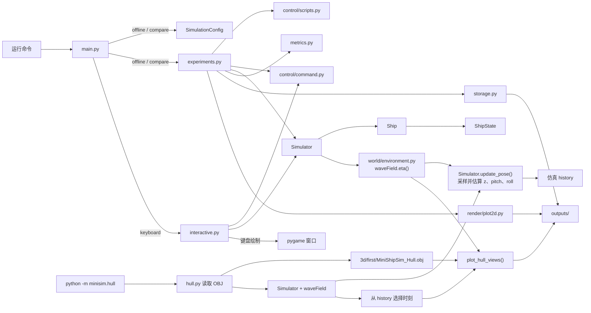

# MiniShipSim 当前项目结构

本文记录当前代码的文件职责和主要调用关系。项目包含 2D 航行仿真、离线与键盘运行流程，以及波浪驱动的船体姿态估算和 OBJ 船体视图。

## 目录与文件

```mermaid
flowchart TD
    root["MiniShipSim/"]

    root --> main["main.py<br/>统一命令行入口"]
    root --> compat_compare["compare_runs.py<br/>旧对比入口"]
    root --> docs["README.md / PLAN.md / PROJECT_STRUCTURE.md / requirements.txt"]
    root --> gitignore[".gitignore"]
    root --> archive["MiniShipSim.zip<br/>项目归档"]
    root --> old_outputs["comparison.csv / comparison.png<br/>state.png / tra.png<br/>根目录旧运行产物"]
    root --> vscode[".vscode/settings.json<br/>编辑器设置"]

    root --> examples["examples/"]
    examples --> keyboard_example["realtime_keyboard.py<br/>键盘模式兼容入口"]
    examples --> turning_example["demo_turning.py<br/>示例占位文件"]

    root --> data["data/.gitkeep<br/>预留数据目录"]

    root --> hull_assets["3d/first/"]
    hull_assets --> obj["MiniShipSim_Hull.obj"]
    hull_assets --> blend["MiniShipSim_Hull.blend"]
    hull_assets --> report["hull_report.json"]
    hull_assets --> previews["preview_side.png / preview_stern.png<br/>preview_three_quarter.png"]

    root --> outputs["outputs/ 仿真生成结果（忽略，不纳入版本控制）"]
    outputs --> offline["offline/"]
    offline --> history["simulation_history.csv"]
    offline --> summary["run_summary.csv"]
    offline --> plots["tra.png / state.png"]
    outputs --> compare["compare/"]
    compare --> comp_csv["comparison.csv"]
    compare --> comp_png["comparison.png"]

    root --> pkg["minisim/"]
    pkg --> state["state.py<br/>ShipState"]
    pkg --> pkg_init["__init__.py"]
    pkg --> ship["ship.py<br/>船舶状态更新"]
    pkg --> simulator["simulator.py<br/>仿真步进、波浪姿态估算与 history"]
    pkg --> config["config.py<br/>dt、步数、输出目录"]
    pkg --> experiments["experiments.py<br/>单次运行与方案对比"]
    pkg --> interactive["interactive.py<br/>实时键盘窗口"]
    pkg --> metrics["metrics.py<br/>航程与速度统计"]
    pkg --> storage["storage.py<br/>CSV 保存"]
    pkg --> csv_compat["csv_export.py<br/>旧导入路径兼容层"]
    pkg --> hull["hull.py<br/>OBJ 网格读取与船体波浪演示"]

    pkg --> control["control/"]
    control --> control_init["__init__.py"]
    control --> command["command.py<br/>控制量"]
    control --> scripts["scripts.py<br/>预设控制脚本"]

    pkg --> render["render/"]
    render --> render_init["__init__.py"]
    render --> plot2d["plot2d.py<br/>轨迹、状态、对比和船体视图"]

    pkg --> physics["physics/ 物理模型模块"]
    physics --> physics_init["__init__.py"]
    physics --> drag["drag.py"]
    physics --> propulsion["propulsion.py"]
    physics --> steering["steering.py"]

    pkg --> world["world/"]
    world --> world_init["__init__.py"]
    world --> environment["environment.py<br/>waveField 波面高度 eta(x, y, time)"]
```

`.venv/` 和 `__pycache__/` 是本地虚拟环境及 Python 缓存，不属于项目源码结构，因此没有展开。

## 主要运行关系

离线运行和方案对比由 `experiments.py` 共用运行函数；实时键盘模式调用同一个 `Simulator`，目前不传入波浪。船体演示由 `minisim.hull` 加载 OBJ，运行带波浪的仿真，再从 `history` 选取状态，绘制同一船体的侧视和后视。

当前波浪通过船中心及船首、船尾、左右舷的采样点估算升沉、俯仰和横摇，并把结果写入 `history`。姿态直接跟随波面，尚未加入垂向惯性和浮力；波浪也尚未改变船舶的水平运动。船体视图目前是静态图，可通过选择不同时间的状态生成多张图片，连续动画尚未实现。

船体坐标约定为 `+X` 朝船头、`+Y` 朝左舷、`+Z` 朝上。OBJ 读取目前放在 `minisim/hull.py`；等其他功能也需要读取网格时，再考虑将读取逻辑拆分到独立的几何模块。
